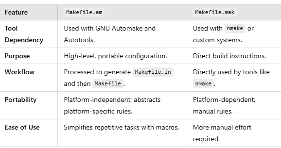

# What is a Makefile?

> A `Makefile` is a simple text file used by the make utility to automate tasks like **compiling code**, **building programs**, or **running scripts**. It's especially common in C, C++, and other compiled languages but can be used for any repetitive task.

## Here’s a step-by-step explanation of what Makefile is and how it works:

### What is a Makefile?

- A Makefile contains a set of rules that specify how to build or generate files from source files.
- It tells the make tool what to do and how to do it.
- Commonly used in projects to automate repetitive tasks like compiling and linking code.

### Basic Structure of a Makefile

A Makefile has three main parts:

1. Targets: Things you want to create (e.g., a compiled program, object file).
2. Dependencies: Files required to build the target (e.g., source code files).
3. Commands: Actions to produce the target from the dependencies.
   Syntax:

```make
target: dependencies
    command
```

### Example:

```make
my_program: main.o utils.o
    gcc -o my_program main.o utils.o
```

### How It Works

1. make looks for a file named Makefile (or makefile) in the directory.
2. It reads the rules and checks the targets and their dependencies.
3. If the dependencies are newer than the target (or the target doesn’t exist), the commands are run.

### Key Concepts

1.  Targets:

    - Usually a file that needs to be generated.
    - Common examples: .o files, executables, or all (a convention for "build everything").
    - Special targets: clean (for removing temporary files), install (for installing software).

2.  Dependencies:

    - Files that the target depends on.
    - Example: An object file (main.o) depends on a source file (main.c).

      ```make
      my_program: main.o utils.o
      gcc -o my_program main.o utils.o
      ```

3.  Commands:

    - Shell commands to create the target.
    - Commands must be indented using a TAB, not spaces.

### Example Makefile

```make

# Variables

CC = gcc
CFLAGS = -Wall -g

# Rules

all: my_program

my_program: main.o utils.o
$(CC) $(CFLAGS) -o my_program main.o utils.o

main.o: main.c
$(CC) $(CFLAGS) -c main.c

utils.o: utils.c
$(CC) $(CFLAGS) -c utils.c

clean:
rm -f \*.o my_program
```

### Explanation of the Example:

- CC and CFLAGS are variables. You can reuse them to avoid repetition.
- all is a phony target that tells make to build my_program.
- Rules like main.o: main.c specify dependencies and how to generate the target (main.o).
- The clean target is used to delete generated files, keeping the workspace tidy.

### Why Use Makefiles?

1. Automation: Simplifies repetitive tasks like compiling, testing, or cleaning.
2. Efficiency: Only recompiles what has changed.
3. Standardization: Provides a consistent way to build a project.

### Advanced Features

1. Phony Targets: Targets that don’t correspond to files (e.g., clean or all).

```make
Copy code
.PHONY: clean
clean:
rm -f \*.o my_program
```

2. Pattern Rules: Generalized rules for multiple targets.

```make
Copy code
%.o: %.c
$(CC) $(CFLAGS) -c $<
```

3. Automatic Variables:

   - \$@: The current target.
   - \$<: The first dependency.
   - \$^: All dependencies.

#### Example:

```make
my_program: main.o utils.o
$(CC) -o $@ $^
```

4. Include Other Makefiles:

```make
include common.mk
```

### Running a Makefile

1. Default command:

```bash
make
```

- Runs the first target in the Makefile (usually all).

2. Specify a target:

```bash
make clean
```

### Common Issues

1. Indentation: Commands must use a TAB, not spaces.
2. Dependency Management: Forgetting to include all dependencies can lead to incorrect builds.
3. File Names: The target file name must match what’s generated.
   > **In summary**, a Makefile is like a recipe book for building your project. Each target is a dish, dependencies are the ingredients, and commands are the cooking steps!

### What is the difference between Makefile.am and Makefile.mak?

The difference between Makefile.am and Makefile.mak lies in their purposes, contexts, and the tools that use them. Here's a breakdown:

1. Makefile.am

   - Used With: The Automake tool, which is part of the GNU build system.
   - Purpose: A high-level, user-friendly template file that describes how to build a project. Automake uses it to generate a Makefile.in.
   - Role in the Build System:
     - Makefile.am is a source file written by developers.
     - Automake processes it to create a Makefile.in.
     - The ./configure script then uses Makefile.in to generate the final Makefile.

   #### Key Features of Makefile.am:

   - Simplifies writing build rules; developers don’t need to handle platform-specific details.
   - Example:
     ```make
      bin_PROGRAMS = my_program
      my_program_SOURCES = main.c utils.c
     ```
     - This specifies that the my_program executable depends on main.c and utils.c.
   - Typically found in projects that follow the GNU Autotools build system.

2. Makefile.mak

   - Used With: Often associated with Microsoft tools like Visual Studio's nmake or other custom build systems.
   - Purpose: A manual build file format for specifying build rules, often tailored to specific tools.
   - Role in the Build System:
     - It directly defines build rules for the nmake tool (or similar).
     - Doesn't involve an intermediate configuration step like Makefile.am.

   #### Key Features of Makefile.mak:

   - Contains explicit instructions, similar to a traditional Makefile.

   - Example:

     ```make
     all: my_program.exe

     my_program.exe: main.obj utils.obj
     link /OUT:my_program.exe main.obj utils.obj

     main.obj: main.c
     cl /c main.c
     ```

   - Primarily used in environments where GNU Autotools is not the standard.

### Key Differences



### When to Use Which?

- Makefile.am:
  - For GNU-based open-source projects.
  - When targeting Unix/Linux platforms with a focus on portability.
- Makefile.mak:
  - For Windows projects using nmake or similar tools.
  - When working in environments that don't use GNU tools.
    > Both are used to describe build processes, but they cater to different tools and ecosystems.

### What does this "!INCLUDE" mean in Makefile.mak?

> The !INCLUDE directive in a Makefile.mak is used in Microsoft's nmake utility to include another file within the current makefile.

### What is !INCLUDE?

- !INCLUDE tells nmake to include and process the contents of another file.
- It's similar to the #include directive in C/C++.
- It allows splitting a large makefile into smaller, modular parts for better maintainability.

### Syntax

```make
!INCLUDE <filename>
```

- \<filename>: The path to the file you want to include.
- You can use absolute paths, relative paths, or environment variables.

### Example

#### Main Makefile.mak:

```make
!INCLUDE common.mak

all: program.exe

program.exe: main.obj utils.obj
link /OUT:program.exe main.obj utils.obj
```

#### common.mak:

```make
Copy code
CC = cl
CFLAGS = /c /W4

main.obj: main.c
$(CC) $(CFLAGS) main.c

utils.obj: utils.c
$(CC) $(CFLAGS) utils.c
```

### How It Works

1. nmake processes the Makefile.mak file.
2. When it encounters !INCLUDE common.mak, it inserts the content of common.mak at that point.
3. Variables or rules defined in common.mak can now be used in the main Makefile.mak.

### Why Use !INCLUDE?

1. Modularity: Reuse common rules, variables, or definitions across multiple makefiles.
2. Maintainability: Break large makefiles into smaller, manageable parts.
3. Consistency: Share common build settings across projects or components.

### Key Notes

- !INCLUDE is specific to Microsoft's nmake and is not part of GNU Make.
- It must start at the beginning of a line with no spaces before !.
- If the included file cannot be found, nmake will throw an error.

> **In short**, !INCLUDE acts like a file insertion mechanism in Makefile.mak when working with nmake. It’s used to modularize and organize build configurations.

### What does this ".c.obj::" mean in .mak file?

> The ".c.obj::" construct in a .mak file (used with nmake) is a double-colon inference rule. It defines a pattern rule or suffix rule for converting .c files (C source files) into .obj files (compiled object files).

### What It Does

- Purpose: It specifies how to compile .c files into .obj files when no explicit rules are provided for a specific .c file.
- Double-Colon (::): Indicates that this is a special suffix rule for nmake. Unlike single-colon rules, double-colon rules are processed differently:
  - They apply globally to all files matching the pattern (.c -> .obj in this case).
  - Multiple double-colon rules for the same target type are allowed and won't overwrite each other.

### Example

#### Rule Definition:

```make
.c.obj::
cl /c /Fo$*.obj $<
```

#### Explanation:

1. .c.obj:
   - This means the target is any .obj file that corresponds to a .c file.
2. cl /c /Fo$\_.obj $<:
   - cl: The Microsoft C compiler.
   - /c: Compile only (do not link).
   - /Fo$\_.obj: Output file named after the input file, but with a .obj extension.
   - $<: The input file (e.g., file.c).

#### How It Works:

If you run nmake with the following source file:

```make
file.c
```

The rule .c.obj:: will:

1. Automatically compile file.c into file.obj using the specified command.
2. Produce the output: file.obj.

### A Complete Example

#### Makefile.mak:

```make
.c.obj::
cl /c /Fo$\*.obj $<

all: main.obj utils.obj

main.obj: main.c
utils.obj: utils.c
```

#### Workflow:

1. When you type nmake all, nmake uses the .c.obj:: rule to compile main.c and utils.c into main.obj and utils.obj.
2. It executes:

```bash
cl /c /Fomain.obj main.c
cl /c /Foutils.obj utils.c
```

### Key Points

1. Global Rule:
   - The .c.obj:: rule applies to all .c files that need to be converted into .obj files unless there’s a more specific rule for a particular file.
2. Modular and Flexible:
   - Avoids repeating the compilation command for every .c file in the makefile.
3. Customizable:
   - You can modify the command to include additional flags or preprocessing steps.

### Difference Between Single and Double Colons

- Single Colon (:): Defines explicit rules for specific targets.
- Double Colon (::): Defines inference (or suffix) rules and can be used multiple times for the same target type.

> **In summary**, .c.obj:: in an nmake file is a pattern rule that tells nmake how to compile .c files into .obj files, automating and streamlining the build process.

### Explain this:

```make
!IF "$(OPENSSL_DEF)" == "/DENABLE_OPENSSL"
```

The line
is a conditional statement in a Makefile.mak (used by Microsoft's nmake utility). It evaluates whether the value of the variable OPENSSL_DEF is equal to "/DENABLE_OPENSSL". If the condition is true, the subsequent block of code is executed.

### Breaking It Down

1. !IF:

   - This is a preprocessor directive in nmake.
   - It starts a conditional block, similar to if in programming languages.
   - It checks whether the given condition evaluates to true.

2. $(OPENSSL_DEF):

   - Refers to the value of the variable OPENSSL_DEF.
   - Variables in nmake are referenced using $(...).

3. ==:

   - Compares the value of OPENSSL_DEF to the specified string (/DENABLE_OPENSSL).

4. "/DENABLE_OPENSSL":

   - The value being compared. In this context, it likely represents a compiler flag (/D) used to define a macro (ENABLE_OPENSSL) during compilation.

### Context

This conditional block is used to enable or configure optional functionality (like OpenSSL) based on whether the OPENSSL_DEF variable has been set to a specific value. For example:

```make
!IF "$(OPENSSL_DEF)" == "/DENABLE_OPENSSL"
OPENSSL_LIBS = openssl.lib crypto.lib
!ELSE
OPENSSL_LIBS =
!ENDIF
```

- If OPENSSL_DEF is /DENABLE_OPENSSL, the libraries openssl.lib and crypto.lib will be included.
- Otherwise, no OpenSSL libraries are added.

### How It Works

1. The OPENSSL_DEF variable is typically set elsewhere in the makefile or passed via the command line:

```bash
nmake OPENSSL_DEF=/DENABLE_OPENSSL
```

2. During the build process:

   - If OPENSSL_DEF equals /DENABLE_OPENSSL, the !IF block is executed.
   - If it doesn't, the block is skipped, and an optional !ELSE or !ENDIF directive specifies the alternative behavior.

### Common Use Cases

- Enabling optional features (e.g., SSL, debugging, specific hardware support).
- Controlling different build configurations (e.g., Release vs. Debug).
- Including different libraries or compiler flags based on environment variables or user input.

### Full Example

```make
!IF "$(OPENSSL_DEF)" == "/DENABLE_OPENSSL"
CFLAGS = /Iopenssl/include $(CFLAGS)
LIBS = openssl.lib crypto.lib $(LIBS)
!ELSE
CFLAGS = $(CFLAGS)
LIBS = $(LIBS)
!ENDIF

all: program.exe

program.exe: main.obj
link /OUT:program.exe main.obj $(LIBS)
```

1. If you run:

```bash
nmake OPENSSL_DEF=/DENABLE_OPENSSL
```

- The OpenSSL include path and libraries are added to the build.

2. If you run without OPENSSL_DEF or with a different value:

   - The build excludes OpenSSL-specific settings.

### Key Points

- !IF in nmake conditionally executes sections of the makefile.
- It's useful for managing optional features or configurations.
- Comparisons are typically done with variables passed via the environment or command line.

> This approach gives flexibility to tailor builds for different scenarios.
